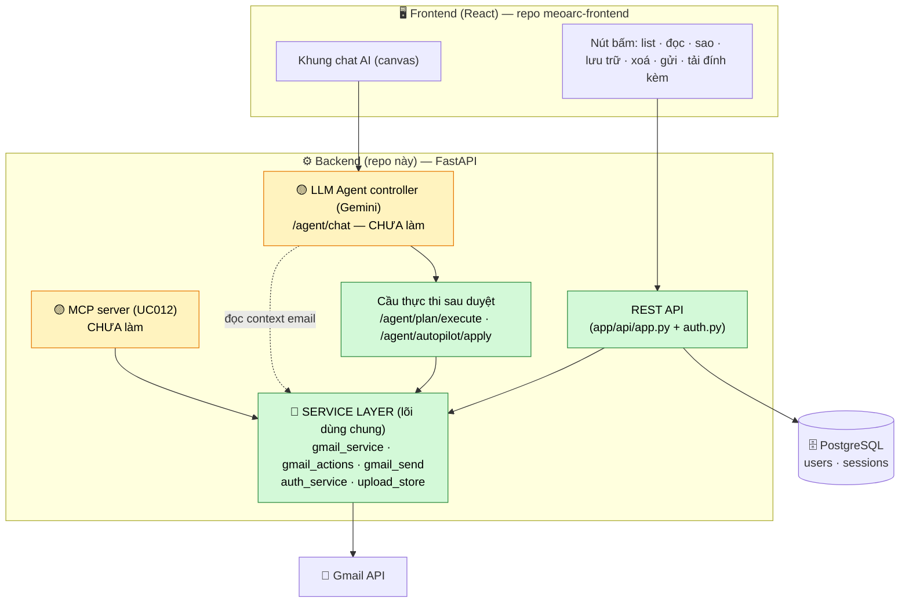
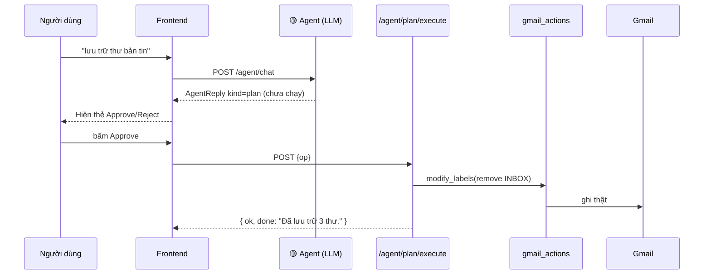

# MeoArc Backend — FastAPI + Gmail + PostgreSQL

> **MeoArc** = Email Intelligence Platform quản lý Gmail bằng LLM agent (Đồ án Nhập môn CNPM, HCMUS — Nhóm 7).
> Repo này là **backend**: đăng nhập Google, đọc/quản lý/gửi Gmail thật, lưu phiên ở PostgreSQL,
> và **cung cấp lớp service + endpoint thực thi** để LLM agent / MCP cắm vào.

Tài liệu này dành cho **cả nhóm** — đặc biệt là người làm **AI Agent** để biết cắm vào đâu mà không phải đọc cả codebase.

---

## 1. Bức tranh tổng thể (kiến trúc agent-native)

Nguyên tắc vàng: **UI người dùng, Agent (LLM), và MCP đều đi qua CÙNG một lớp service.**
Backend này đã xây xong toàn bộ phần **không phải LLM** (màu xanh). Người làm agent chỉ ráp phần **vàng**.



**Đọc sơ đồ:** mọi hành động ghi Gmail (sao, lưu trữ, xoá, gửi…) cuối cùng đều rơi vào **service layer**.
Agent **không cần viết lại Gmail** — nó chỉ gọi service (để đọc context) và gọi `/agent/plan/execute` (để thực thi sau khi user duyệt).

---

## 2. Công nghệ

| Thành phần | Dùng gì |
|---|---|
| Ngôn ngữ | Python 3.13 |
| Quản lý môi trường/thư viện | **uv** |
| Web framework | FastAPI + Uvicorn |
| Database | **PostgreSQL** (qua SQLAlchemy 2.0 + driver `psycopg` v3) |
| Gọi HTTP (Google/Gmail) | httpx |
| Đăng nhập | Google OAuth 2.0 tự dựng (không Supabase) |

---

## 3. Cài đặt & chạy

### Yêu cầu
- Python 3.13, `uv` (`python -m pip install uv`)
- **PostgreSQL** đang chạy + một database tên `meoarc`

### Các bước
```powershell
cd D:\meoarc-backend

# 1) Tạo file .env từ mẫu rồi điền giá trị thật
copy .env.example .env
#   → điền GOOGLE_CLIENT_ID / SECRET (Google Cloud Console)
#   → điền DATABASE_URL, ví dụ:
#     DATABASE_URL=postgresql+psycopg://postgres:<mật_khẩu>@localhost:5432/meoarc

# 2) Chạy server (lần đầu uv tự cài thư viện). Bảng users/sessions tự tạo.
uv run main.py
```
Server ở **http://localhost:8000**, tài liệu API tự sinh ở **/docs**.

> Chưa cài Postgres? Bỏ trống `DATABASE_URL` → tự lùi về SQLite file để chạy tạm.
> Console Windows không in được tiếng Việt → `$env:PYTHONUTF8=1`.

### Chạy chung với Frontend
| Terminal | Lệnh | Cổng |
|---|---|---|
| 1 | `cd D:\meoarc-backend; uv run main.py` | 8000 |
| 2 | `cd D:\meoarc-frontend; npm run dev` | **5173** (phải đúng để khớp redirect sau login) |

FE nối BE bằng file `.env.local` chứa `VITE_API_BASE_URL=http://localhost:8000`.

---

## 4. Cấu trúc thư mục (kiến trúc phân lớp)

```
app/
├── api/
│   ├── app.py          # tạo app + TẤT CẢ route + exception handler (lỗi chuẩn hoá)
│   └── auth.py         # router /auth/* (login, callback, logout, revoke)
├── core/
│   ├── config.py       # đọc .env (khoá Google, DATABASE_URL…)
│   ├── db.py           # engine + session SQLAlchemy (Postgres/SQLite)
│   └── deps.py         # "bảo vệ cửa": get_current_user / get_gmail_token (tự refresh)
├── models/             # bảng DB: user.py, session.py
├── repo/               # truy vấn DB: user_repo, session_repo
├── schemas/            # khuôn dữ liệu Pydantic vào/ra (email, send, actions, agent…)
└── services/           # 🧩 LÕI NGHIỆP VỤ — phần agent sẽ tái dùng
    ├── gmail_service.py    # ĐỌC: list/search/chi tiết/đính kèm + cache 60s
    ├── gmail_actions.py    # GHI: đổi nhãn (đọc/sao/lưu trữ) · xoá · gắn nhãn
    ├── gmail_send.py       # GỬI: dựng MIME + gửi/trả lời (kèm đính kèm)
    ├── auth_service.py     # OAuth: dựng URL · đổi code→token · refresh · revoke
    └── upload_store.py     # giữ bytes tệp đính kèm tạm (RAM)
```

**Quy ước:** route (api/) chỉ điều phối, mỏng → logic nằm ở **services/**; DB nằm ở **repo/**.

---

## 5. Tham chiếu API (đã làm xong ✅)

> Mọi endpoint Gmail dùng `Depends(get_gmail_token)` → **tự làm mới** access_token khi hết hạn (không bắt login lại mỗi giờ).
> Lỗi trả về chuẩn: `{ "error": { "code": "...", "message": "...", "details": {} } }`.

### Auth (UC001/002)
| Method | Path | Việc |
|---|---|---|
| GET | `/auth/google/start` | Bắt đầu đăng nhập → redirect sang Google |
| GET | `/auth/google/callback` | Google gọi lại → tạo phiên + set cookie |
| GET | `/me` | User của phiên hiện tại |
| POST | `/auth/logout` | Đăng xuất (xoá phiên) |
| POST | `/auth/revoke` | Thu hồi quyền Gmail (gọi Google revoke) |

### Đọc & tìm (UC003/004/005)
| Method | Path | Việc |
|---|---|---|
| GET | `/emails` | List theo `folder`; lọc `unread/starred/attachment`; tìm `q`; phân trang `cursor/limit`; `fresh=true` bỏ cache |
| GET | `/emails/{id}` | Chi tiết 1 thư (thân đầy đủ + đính kèm) |
| POST | `/emails/{id}/read` | Đánh dấu đã/chưa đọc khi mở |
| GET | `/emails/{id}/attachments/{name}` | Tải tệp đính kèm |

### Quản lý — ghi (UC006)
| Method | Path | Body |
|---|---|---|
| POST | `/emails/actions/read` | `{ ids, read }` |
| POST | `/emails/actions/important` | `{ ids, value }` (gắn/bỏ sao) |
| POST | `/emails/actions/archive` | `{ ids }` (bỏ nhãn INBOX) |
| POST | `/emails/actions/delete` | `{ ids }` (vào thùng rác) |
| POST | `/emails/actions/label` | `{ ids, label }` (tạo/gắn nhãn Gmail) |

### Gửi (UC010)
| Method | Path | Body |
|---|---|---|
| POST | `/emails/send` | `{ to, cc?, bcc?, subject, body, attachmentIds? }` |
| POST | `/emails/{id}/reply` | `{ body }` (BE tự suy người nhận/tiêu đề/luồng) |
| POST | `/uploads` | multipart `file` → `{ id, name, size }` (id để gắn khi gửi) |

### Cầu thực thi cho Agent (đã làm — KHÔNG phải LLM)
| Method | Path | Việc |
|---|---|---|
| POST | `/agent/plan/execute` | Chạy 1 `PlanOp` đã được user Approve → trả câu `done` |
| POST | `/agent/autopilot/apply` | Áp lô tự-lái đã duyệt `{ archive, markRead, flag }` |

---

## 6. Human-in-the-loop — cơ chế bất biến

Quy tắc: **agent KHÔNG bao giờ tự gửi/xoá khi chưa có xác nhận tường minh.** Mức xác nhận theo rủi ro:

| Loại hành động | Cơ chế |
|---|---|
| Read-only (tóm tắt, triage…) | chạy ngay, không hỏi |
| Ghi hoàn-tác-được (đọc, sao, lưu trữ) | xác nhận nhẹ |
| **Không hoàn tác (gửi, xoá, bulk)** | **bắt buộc Approve** |



---

## 7. Trạng thái: xong gì / còn gì

### ✅ Đã xong (phần non-LLM — của backend này)
- Đăng nhập Google + phiên ở Postgres + **tự refresh token**
- Đọc/tìm/lọc/phân trang Gmail + xem chi tiết + tải đính kèm
- Quản lý: đọc · sao · lưu trữ · xoá · gắn nhãn
- Gửi & trả lời thư **kèm đính kèm**
- Thu hồi quyền · chuẩn hoá lỗi · cache + nút Làm mới
- 2 endpoint thực thi-sau-duyệt cho agent

### 🟡 Còn lại — phần AI/Agent (người khác làm)
| Việc | Cắm vào đâu |
|---|---|
| `/agent/chat` thật (Gemini) | thay stub trong `app.py`; trả `AgentReply` (xem `docs/03-AGENT-SPEC.md` bên FE) |
| Các skill: summarize/triage/digest/brief/categorize/autopilot | gọi `gmail_service.list_messages(...)` lấy context email cho LLM |
| Thực thi sau khi user Approve | **gọi sẵn** `/agent/plan/execute` + `/agent/autopilot/apply` |
| MCP server (UC012) | wrap chính `services/` thành MCP tools (cùng lõi) |
| Semantic search (`nl=true`) | nâng cấp param trong `/emails` |

### ⚪ Tuỳ chọn (chưa cần)
`/emails/drafts` (lưu nháp) · `/settings` (FE đang dùng localStorage) · Alembic migrations.

---

## 8. Gửi người làm Agent — 3 điều cần nhớ

1. **Lấy context email cho LLM:** `from app.services import gmail_service` →
   `emails, _ = gmail_service.list_messages(access_token, folder="inbox")`. Token lấy qua `Depends(get_gmail_token)`.
2. **Đừng tự gọi Gmail để GHI.** Trả `plan`/`autopilot` cho FE; khi user Approve, FE gọi
   `/agent/plan/execute` — nó đã thực thi đúng qua `gmail_actions`. Bạn chỉ lo phần "quyết định".
3. **Mọi thứ dùng chung 1 lõi:** UI, agent, MCP đều đi qua `app/services/`. Sửa logic Gmail ở đó là cả 3 nơi cùng được.
```
