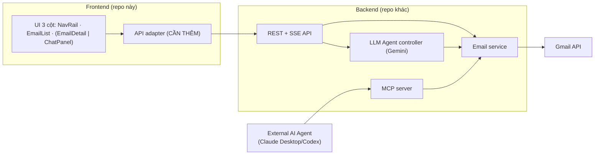

# MeoArc — Tổng quan tài liệu kỹ thuật (FE làm nguồn chân lý)

> **Mục đích:** Frontend MeoArc đã hiện thực đầy đủ 16 Use Case (+ UC017 Autopilot) ở dạng mockup chạy được. Bộ tài liệu này **trích các "hợp đồng" (contract) ẩn trong FE ra thành đặc tả rõ ràng**, để Backend (LLM agent / Gmail / MCP) và các bên liên quan build theo cho **đủ, đồng bộ, thống nhất — không sót, không sai**.
>
> Nguyên tắc: **FE định nghĩa *cái gì* và *hành xử ra sao*; BE hiện thực *bằng cách nào*.** Khi có mâu thuẫn, lấy hành vi FE + tài liệu này làm chuẩn (hoặc thống nhất sửa cả hai).

---

## 1. Bối cảnh

- **Sản phẩm:** MeoArc — Email Intelligence Platform quản lý Gmail bằng LLM agent. Đồ án Nhập môn CNPM, HCMUS, Nhóm 7.
- **Repo này (FE):** React 19 + Vite + TypeScript + Tailwind v4. Hiện là mockup tự cấp dữ liệu (mock), chưa nối backend thật.
- **Repo BE (riêng):** FastAPI + Gemini + Gmail API + MCP server.
- **Actor:** `User` (qua web) và `External AI Agent` (Claude Desktop/Codex — chỉ qua MCP, UC012).

## 2. Kiến trúc mục tiêu

Điểm mấu chốt: **Agent (UC007) là controller trung tâm.** Mọi AI skill (tóm tắt, phân loại, triage, digest, brief, autopilot, soạn thư) đều là khả năng mở rộng của UC007 và trả về cùng một kiểu dữ liệu `AgentReply` mà canvas FE biết render. MCP (UC012) gọi **cùng lớp service**, không qua tầng ngôn ngữ tự nhiên.

## 3. Cơ chế bất biến — phải giữ đúng khi làm BE

1. **Human-in-the-loop:** mọi hành động **không hoàn tác** (gửi thư, xoá, thao tác hàng loạt) **bắt buộc** có bước xác nhận (Approve/Reject) trước khi thực thi. FE đã dựng UI xác nhận; BE **không được tự ý** thực thi khi chưa có xác nhận.
2. **Agent minh bạch (glass-box):** agent hiện *kế hoạch* trước khi chạy multi-step, hiện *lý do* cho mỗi quyết định, và *báo tóm tắt* sau khi xong.
3. **Hỏi lại khi mơ hồ:** request không rõ → trả về câu hỏi làm rõ (`AgentReply` kind `text`), không đoán bừa.
4. **Read-only mặc định an toàn:** tóm tắt/triage/digest/brief là read-only, chạy được ngay; chỉ hành động ghi mới cần xác nhận.

## 4. FE đang "giả lập" ở đâu (mock → real)

| Vùng | FE hiện tại (mock) | BE / bên liên quan cần làm |
|---|---|---|
| Dữ liệu email | `src/data/emails.ts` (tĩnh) | API trả `Email` đúng shape ([01](01-DATA-MODEL.md)) |
| Agent NL (UC007) | `src/lib/agent.ts` → `interpretCommand` (rule-based) | LLM thật, trả đúng `AgentReply` ([03](03-AGENT-SPEC.md)) |
| Hành động thư (UC006) | `EmailActions` in-memory ở `app-shell.tsx` | Endpoint thật → Gmail ([02](02-API-CONTRACT.md)) |
| Search/Filter (UC005) | `src/lib/search.ts` (`interpretNL`, `matchText`) | Filter + semantic search phía BE |
| Auth (UC001/002) | `src/auth/auth-context.tsx` (giả lập) | OAuth Google + revoke token thật |
| AI skills | suy ra từ field `priority`/`tldr` tĩnh | LLM sinh thật |
| MCP (UC012) | mô tả trong `settings-dialog.tsx` | Tool schema + server thật ([04](04-MCP-TOOLS.md)) |
| Gửi thư/đính kèm (UC010) | `compose-dialog.tsx` (UI), không gửi thật | Gửi qua Gmail + upload đính kèm |

## 5. Bộ tài liệu này gồm gì

| File | Nội dung | Dành cho |
|---|---|---|
| [00-OVERVIEW.md](00-OVERVIEW.md) | Tổng quan, kiến trúc, nguyên tắc (file này) | Mọi bên |
| [01-DATA-MODEL.md](01-DATA-MODEL.md) | Ngôn ngữ chung: mọi kiểu dữ liệu + ví dụ JSON | BE, FE, QA |
| [02-API-CONTRACT.md](02-API-CONTRACT.md) | Hợp đồng REST + SSE FE↔BE | BE (chính), FE |
| [03-AGENT-SPEC.md](03-AGENT-SPEC.md) | Đặc tả agent/LLM: intent → reply, guardrails | BE/LLM |
| [04-MCP-TOOLS.md](04-MCP-TOOLS.md) | UC012: tool MCP + schema + scope | BE/MCP |
| [05-UC-TRACEABILITY.md](05-UC-TRACEABILITY.md) | Ma trận UC ↔ component ↔ API ↔ trạng thái | PM/QA, mọi bên |

## 6. Quy ước chung

- **Ngôn ngữ tài liệu:** tiếng Việt. **Định danh code (type/field/endpoint):** tiếng Anh, `code style`.
- **Đơn vị thời gian:** ISO 8601 (`2026-06-21T08:42:00+07:00`) ở tầng API; FE hiển thị dạng thân thiện (`Hôm nay, 08:42`).
- **i18n:** hỗ trợ `vi` (mặc định) và `en` (UC013). Chuỗi nội dung do BE trả nên kèm khoá hoặc đã địa phương hoá theo `Accept-Language`.
- **Mọi thay đổi contract** phải cập nhật file tương ứng tại đây để các bên đồng bộ.

> Các dấu **(ĐỀ XUẤT)** trong tài liệu là gợi ý FE đưa ra; BE có thể chốt khác nhưng phải cập nhật lại tài liệu để giữ đồng bộ.
